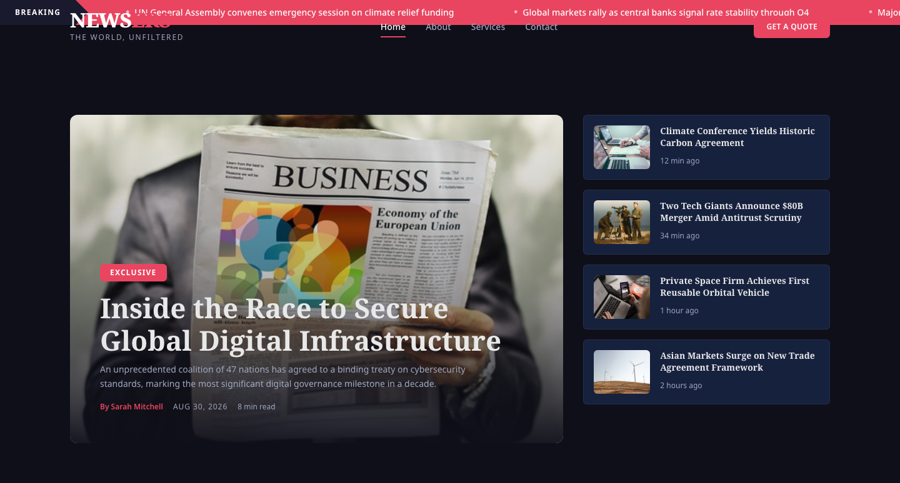

# NEWSERS — HTML Template

> "The World, Unfiltered" — A premium, framework-free HTML template for a global news agency.

A dark-themed, editorial-grade template built for a press wire service. Pure HTML, CSS custom properties, and vanilla JavaScript. No dependencies, no build step.

## Live Demo

[Get Started with NEWSERS](https://tally.so/r/q4q1L9)

## Pages

| Page | File | Description |
|------|------|-------------|
| Home | `index.html` | Breaking ticker, hero with lead story + sidebar, wire feed grid, category sections, newsletter CTA |
| About | `about.html` | Agency history timeline, global bureaus grid, editorial team, mission and values |
| Services | `services.html` | Wire services, custom reporting, media consulting packages with pricing tiers |
| Contact | `contact.html` | Contact form, bureau locations, press credentials information |

## 📸 Screenshot



## Design System

### Colors

| Token | Hex | Usage |
|-------|-----|-------|
| `--c-dark` | `#1A1A2E` | Primary dark background, header on scroll |
| `--c-navy` | `#0F3460` | Accent blue, value card gradients |
| `--c-red` | `#E94560` | Brand accent, CTAs, badges, hover states |
| `--c-surface` | `#16213e` | Card backgrounds |
| `--c-bg` | `#0f0f1a` | Page background |
| `--c-text` | `#e8e8e8` | Primary text |
| `--c-text-muted` | `#a0a8c0` | Secondary text |

### Typography

- **Headings**: Noto Serif (weights 400, 700, 900)
- **Body**: Noto Sans (weights 400, 500, 600, 700)
- Scale: `--fs-xs` (0.75rem) through `--fs-3xl` (3.5rem)

### Components

- **Buttons**: `.btn`, `.btn--primary`, `.btn--outline`, `.btn--ghost`, `.btn--sm`, `.btn--lg`
- **Cards**: `.wire-card`, `.service-card`, `.pricing-card`, `.bureau-card`, `.team-card`, `.value-card`
- **Form**: `.form-group`, `.form-ok`, `.form-err` (never uses `alert()`)
- **Navigation**: Fixed header with mobile hamburger toggle (`.open` + `aria-expanded`)
- **Ticker**: Breaking news marquee with seamless scroll animation

## Features

- **No frameworks** — Pure HTML, CSS, vanilla JS
- **CSS custom properties** for all design tokens
- **IntersectionObserver** scroll reveals (threshold 0.12, rootMargin "0px 0px -8% 0px")
- **Active nav** via `location.pathname.split("/").pop()`
- **Mobile nav** with `.open` class + `aria-expanded` attribute
- **Footer year** via `[data-year]` attribute
- **Form handling** via `[data-form]` with `.form-ok` / `.form-err` feedback (never `alert()`)
- **`prefers-reduced-motion`** respected throughout
- **28 original images** from source assets
- **Google Fonts CDN only** (fonts.googleapis.com + fonts.gstatic.com)
- **Responsive** from mobile to desktop with fluid spacing

## File Structure

```
news-agency-html-template/
├── index.html
├── about.html
├── services.html
├── contact.html
├── README.md
└── assets/
    ├── css/
    │   └── style.css
    ├── js/
    │   └── main.js
    └── img/
        ├── banner-img.jpg
        ├── banner-2.jpg
        ├── chatGPT.jpg
        ├── chatGPT-1.jpg
        ├── degree.png
        ├── features-background.jpg
        ├── features-fashion.jpg
        ├── features-life-style.jpg
        ├── features-sports-1.jpg
        ├── features-technology.jpg
        ├── footer-1.jpg
        ├── footer-2.jpg
        ├── footer-3.jpg
        ├── footer-4.jpg
        ├── footer-5.jpg
        ├── footer-6.jpg
        ├── lifestyle-1.jpg
        ├── lifestyle-2.jpg
        ├── news-1.jpg
        ├── news-2.jpg
        ├── news-3.jpg
        ├── news-4.jpg
        ├── news-5.jpg
        ├── news-6.jpg
        ├── news-7.jpg
        ├── news-8.jpg
        ├── newsletter-1.jpg
        └── weather-icon.png
```

## Browser Support

- Chrome 80+
- Firefox 78+
- Safari 14+
- Edge 80+

## License

Free for personal and commercial use. Attribution appreciated.
